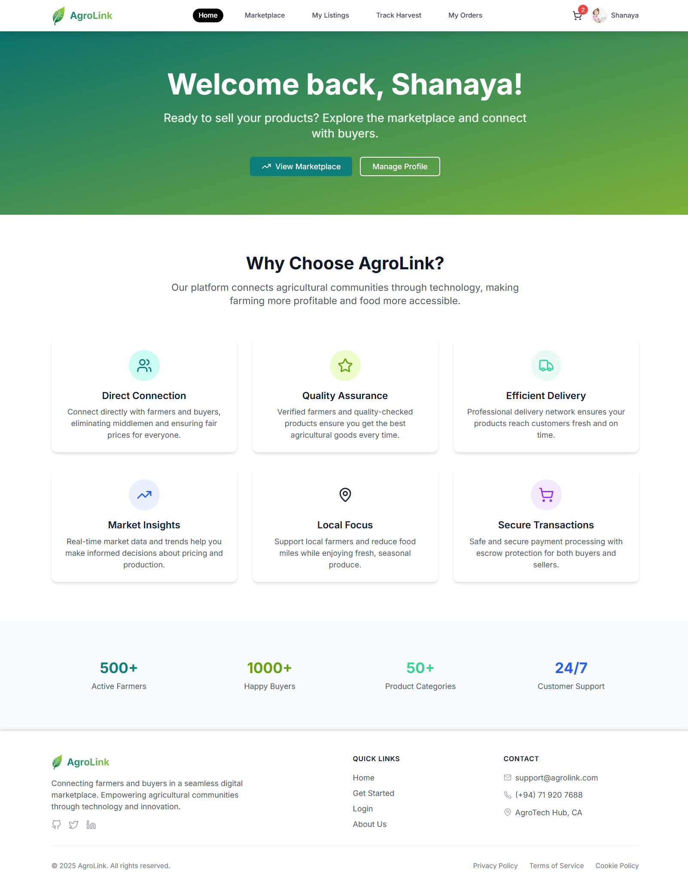
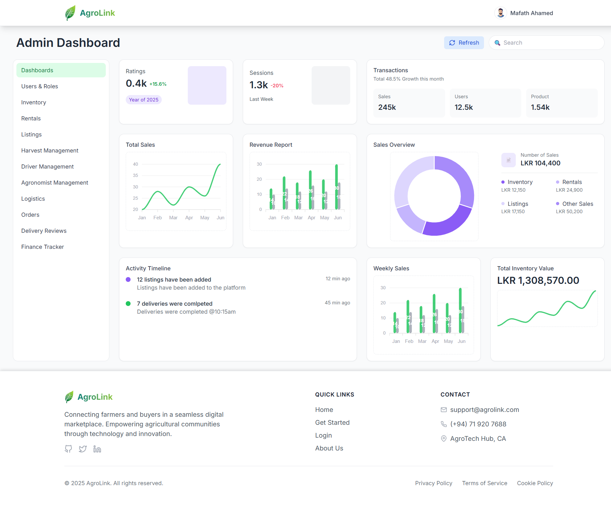
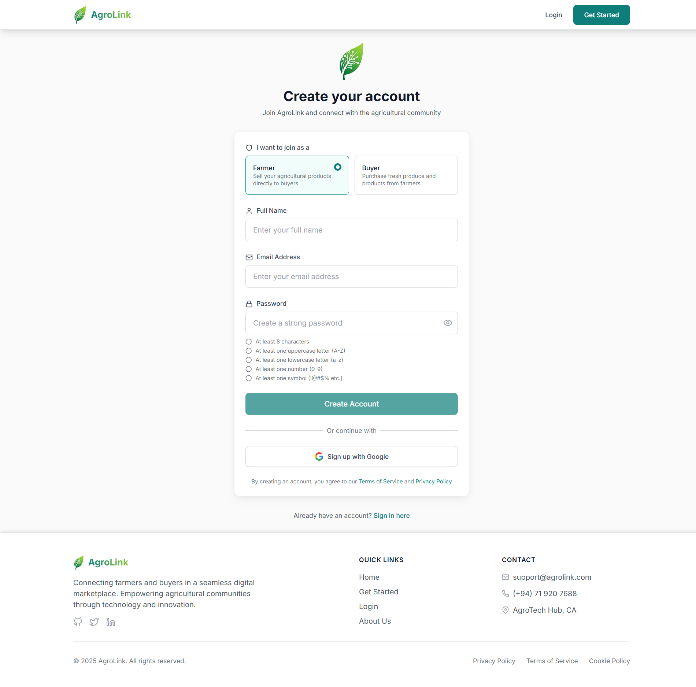
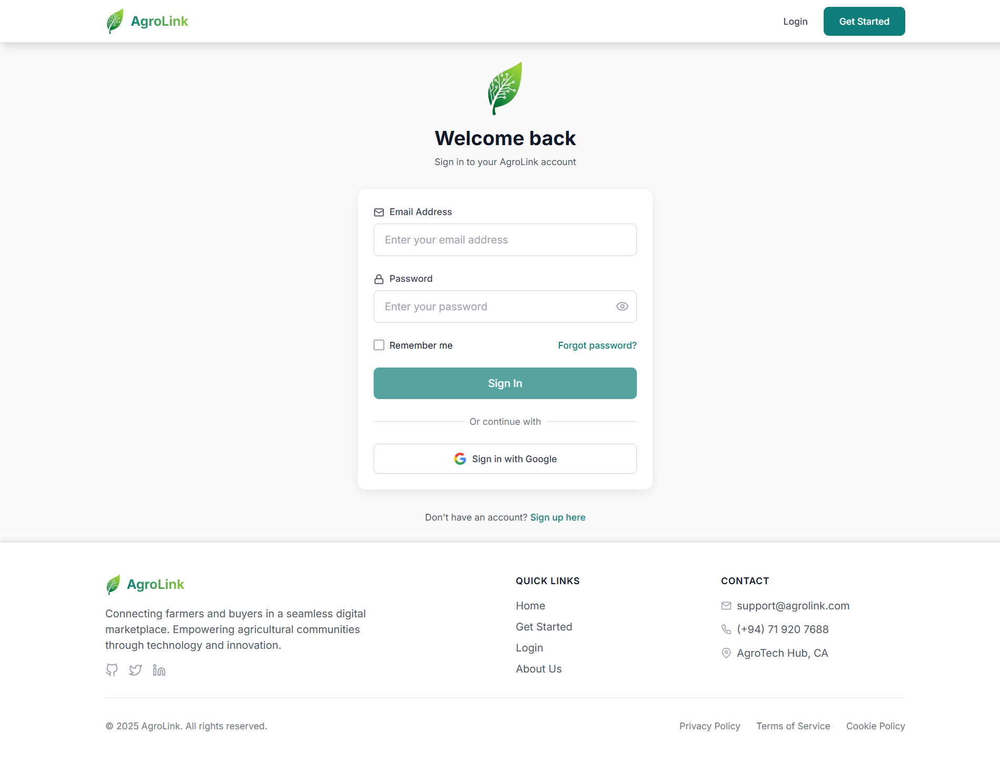
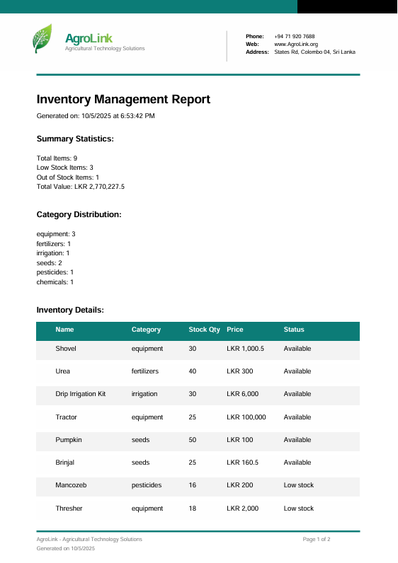

<div align="center">
  
</div>

<h1 align="center">AgroLink – Smart Agricultural Trading & Management System</h1>

<p align="center">
  <strong>Empowering Farmers. Connecting Communities. Building the Future of Agriculture.</strong>
</p>

<p align="center">
  
  
  
  
  
</p>

---

## **About AgroLink**

**AgroLink Online** is a comprehensive digital marketplace platform that connects farmers, buyers, agronomists, and drivers in the agricultural ecosystem. Built with modern web technologies, it facilitates the buying and selling of agricultural products, equipment rentals, harvest management, and delivery services.


## 🚀 **Core Features**

<div align="center" style="margin-bottom: 16px;">
  
</div>

<table>
<tr>
<td width="50%" valign="top">

### 🛒 **Marketplace & E-commerce**
- **Product Listings**: Farmers can list their crops with detailed information, pricing, and images
- **Shopping Cart**: Seamless shopping experience with cart management
- **Order Management**: Complete order processing with status tracking
- **Payment Integration**: Stripe payment processing for secure transactions
- **Inventory Management**: Track agricultural supplies and equipment

</td>
<td width="50%" valign="top">

### 🌾 **Harvest Management**
- **Harvest Requests**: Farmers can request expert assistance for harvest planning
- **Schedule Management**: Agronomists can create and manage harvest schedules
- **Progress Tracking**: Real-time monitoring of harvest activities
- **Expert Consultation**: Direct communication between farmers and agronomists
 - **Notifications**: Alerts for schedule changes and upcoming tasks

</td>
</tr>

<tr>
<td width="50%" valign="top">

### 👥 **Multi-Role User System**
- **Farmers**: List products, manage harvests, track finances
- **Buyers**: Browse marketplace, place orders, track deliveries
- **Agronomists**: Provide expert advice, manage harvest schedules, respond to reports
- **Drivers**: Handle delivery assignments and logistics
- **Administrators**: Platform oversight and management

</td>
<td width="50%" valign="top">

### 🚚 **Delivery & Logistics**
- **Delivery Tracking**: Real-time order tracking and status updates
- **Driver Assignment**: Automated driver allocation for deliveries
- **Route Optimization**: Efficient delivery route planning
- **Review System**: Customer feedback on delivery services

</td>
</tr>
<tr>
<td width="50%" valign="top">

### 💰 **Financial Management**
- **Budget Tracking**: Monitor farm expenses and income
- **Goal Setting**: Set and track financial objectives
- **Transaction History**: Complete financial record keeping
- **Debt Management**: Track and manage agricultural debts

</td>
<td width="50%" valign="top">

### 📊 **Reporting & Analytics**
- **Harvest Reports**: Detailed harvest performance analytics
- **Financial Reports**: Comprehensive financial insights
- **Activity Tracking**: Monitor platform usage and engagement
- **Admin Dashboard**: Platform-wide analytics and management

</td>
</tr>

<tr>
<td width="50%" valign="top">

### 🛠️ **Equipment Rental**
- **Equipment Listings**: Rent out agricultural equipment
- **Booking System**: Schedule equipment rentals
- **Availability Management**: Track equipment availability
- **Rental History**: Complete rental transaction records

</td>
<td width="50%" valign="top">


### 🔒 **Security & Authentication**
- **JWT Authentication**: Secure token-based authentication
- **Role-based Access**: Granular permission system
- **Email Verification**: Account verification system
- **Password Security**: bcrypt encryption

</td>
</tr>
</table>


## **Technology Stack**

<div align="center" style="margin-bottom: 16px;">
  
</div>

<table>
<tr>
<td width="50%" valign="top">

### 🎨 **Frontend Technologies**
<div align="center">


</div>

- **React 19** - Modern UI framework with latest features
- **Vite** - Lightning-fast build tool and dev server
- **Tailwind CSS** - Utility-first CSS framework
- **DaisyUI** - Beautiful component library
- **React Router** - Declarative routing
- **Zustand** - Lightweight state management
- **Axios** - Promise-based HTTP client
- **React Hot Toast** - Elegant notifications
- **ApexCharts** - Interactive data visualization
- **Stripe** - Secure payment processing
 - **jsPDF** - Client-side PDF generation

</td>
<td width="50%" valign="top">

### ⚙️ **Backend Technologies**
<div align="center">


</div>

- **Node.js** - JavaScript runtime environment
- **Express.js** - Fast, unopinionated web framework
- **MongoDB** - NoSQL document database
- **Mongoose** - Elegant MongoDB object modeling
- **JWT** - Secure authentication tokens
- **bcrypt** - Password hashing library
- **Cloudinary** - Cloud image management
- **Nodemailer** - Email sending service
- **Socket.io** - Real-time bidirectional communication
 - **CORS** - Cross-origin resource sharing
 - **dotenv** - Environment variable management

</td>
</tr>
</table>


## 🌐 **Access the Application**


<table>
<tr>
<td width="50%" valign="top">

### 🎨 **Frontend Application**
- **URL**: http://localhost:5173
- **Framework**: React 19 + Vite
- **Features**: Modern UI, Real-time updates
- **Authentication**: JWT-based login system

</td>
<td width="50%" valign="top">

### ⚙️ **Backend API**
- **URL**: http://localhost:5001
- **Framework**: Express.js + Node.js
- **Database**: MongoDB with Mongoose
- **Features**: RESTful API, Real-time communication

</td>
</tr>
</table>

## 📸 **Visuals**

<div align="center">
  
</div>

### **Homepage & Dashboard**
<table>
<tr>
<td width="50%" valign="top">

**Landing Page**

*Modern, responsive homepage with role-based welcome messages*

</td>
<td width="50%" valign="top">

**Admin Dashboard**

*Comprehensive admin panel with analytics and management tools*

</td>
</tr>
</table>

### **Marketplace & E-commerce**
<table>
<tr>
<td width="50%" valign="top">

**Product Marketplace**

*Browse and search agricultural products with advanced filtering*

</td>
<td width="50%" valign="top">

**Shopping Cart**

*Seamless shopping experience with cart management*

</td>
</tr>
</table>

### **Harvest Management**
<table>
<tr>
<td width="50%" valign="top">

**Harvest Dashboard**

*Track harvest progress and manage schedules*

</td>
<td width="50%" valign="top">

**Harvest Scheduling**

*Create and manage harvest schedules with expert consultation*

</td>
</tr>
</table>

### **User Management**
<table>
<tr>
<td width="50%" valign="top">

**Driver Dashboard**

*Manage delivery assignments, status updates, and routes*

</td>
<td width="50%" valign="top">

**Agronomist Dashboard**

*Oversee harvest schedules, respond to requests, and track progress*

</td>
</tr>
</table>

### **Authentication**
<table>
<tr>
<td width="50%" valign="top">

**Signup**

*Multi-role registration with email verification*

</td>
<td width="50%" valign="top">

**Login**

*Secure sign-in with validation and error feedback*

</td>
</tr>
</table>

### **Analytics & Reports**
<table>
<tr>
<td width="50%" valign="top">

**Financial Reports**

*Comprehensive financial tracking and analytics*

</td>
<td width="50%" valign="top">

**Order Management**

*Track orders, deliveries, and customer feedback*

</td>
</tr>
</table>

## **API Documentation**

### **Authentication Endpoints**
- `POST /api/auth/signup` - User registration
- `POST /api/auth/signin` - User login
- `GET /api/auth/me` - Get current user
- `POST /api/auth/logout` - User logout

### **Core Features**
- **Listings**: Product management and marketplace
- **Orders**: Order processing and management
- **Harvest**: Harvest planning and tracking
- **Delivery**: Logistics and delivery management
- **Finance**: Financial tracking and management
- **Inventory**: Supply and equipment management

## **User Roles & Permissions**

| Role | Permissions |
|------|-------------|
| **FARMER** | List products, manage harvests, track finances, view orders |
| **BUYER** | Browse marketplace, place orders, track deliveries, manage cart |
| **AGRONOMIST** | Manage harvest schedules, provide expert advice, respond to reports |
| **DRIVER** | View delivery assignments, update delivery status |
| **ADMIN** | Full platform access, user management, analytics |


## 🏗️ **Project Structure**

```
AgroLink-online-main/
├── backend/
│   ├── src/
│   │   ├── controllers/  # API route handlers
│   │   ├── models/       # Database schemas
│   │   ├── routes/       # API routes
│   │   ├── middleware/   # Custom middleware
│   │   ├── lib/          # Utility functions
│   │   └── scripts/      # Database seeding scripts
│   └── package.json
├── frontend/
│   ├── src/
│   │   ├── components/   # Reusable UI components
│   │   ├── pages/        # Page components
│   │   ├── store/        # State management
│   │   └── lib/          # Utility functions
│   └── package.json
└── README.md
```

## 🔒 **Security Features**

- **JWT Authentication** - Secure token-based authentication
- **Password Hashing** - bcrypt encryption for passwords
- **Email Verification** - Account verification system
- **Role-based Access Control** - Granular permission system
- **Input Validation** - Comprehensive data validation
- **CORS Protection** - Cross-origin request security


## 📄 **License**

This project is licensed under the ISC License.

## 📞 **Support**

For support and questions, please contact the development team or create an issue in the repository.

---

<div align="center">

## 🌟 **AgroLink Online**

**Connecting the agricultural community through technology**


### 🤝 **Get Involved**

[](https://github.com/Mafath/AgroLink-online_v2)
[](https://github.com/Mafath/AgroLink-online_v2)
[](https://github.com/Mafath/AgroLink-online_v2/issues)
[](https://github.com/Mafath/AgroLink-online_v2/pulls)

### **Connect With Us**

[](mailto:contact@agrolink.com)
[](https://linkedin.com/company/agrolink)

---

<div align="center">
  
</div>

</div>
